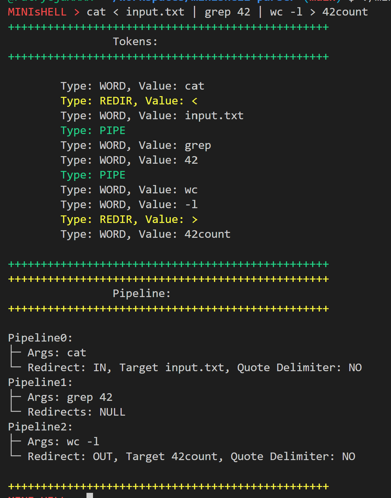
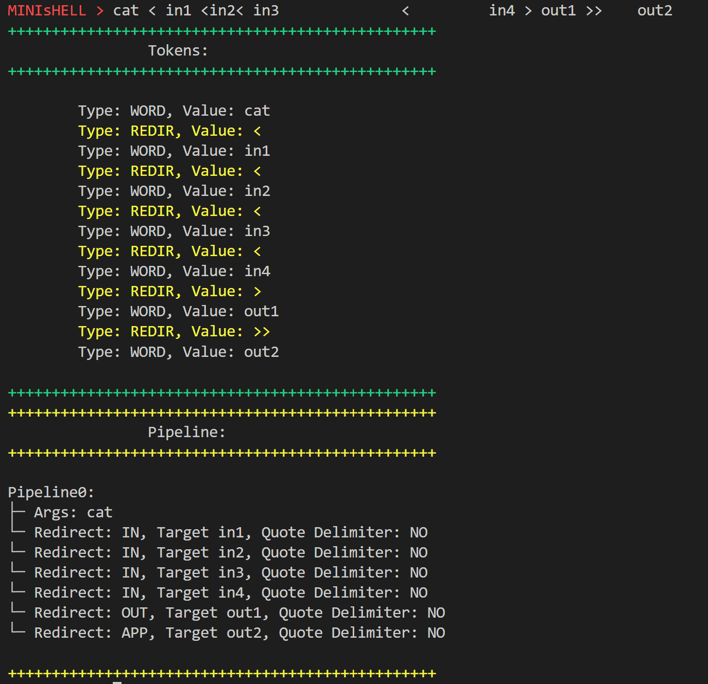

# minishell-parser
A custom shell parser written in C as part of the Minishell project at 42 Berlin. (project passed on April 10, 2025, with 101%)

  
<b>graphical representation: pipeline with three commands (cat, grep, wc)</b>

  

  
<b>graphical representation: command with multiple redirections (whitespaces are of course ignored and there can be any number of them)</b>

  

<b>English</b>

The project implements a parser for a simplified bash-like shell.
It is responsible for analyzing user input and transforming it into a structured data representation ready for execution.

Together with my project partner, we decided early not to implement the Minishell bonus part. As a result, we chose a simpler parsing strategy based on linked lists instead of a tree-based structure.

  The parser supports:
<ul>
  <li>pipe operators (|)</li>
  <li>input and output redirections (<, >, >>, <<)</li>
  <li>single and double quotes (', ")</li>
  <li>environment variables</li>
</ul>

  The parsing process consists of:
<ol>
<li>Tokenizing the user input.</li>
<li>Performing syntactic analysis on generated tokens.</li>
<li>Constructing a linked list structure representing commands along with their redirections and pipelines.</li>
</ol>

The main objective of the project was to understand lexical and syntactic analysis mechanisms in the context of shell implementation.

<b>Polish</b>

Projekt implementuje parser dla uproszczonej powłoki systemowej typu bash-like.
Odpowiada za analizę wejścia użytkownika oraz przekształcenie go w uporządkowaną strukturę danych gotową do dalszego etapu wykonania.

Razem z moim partnerem Minishell wcześnie zdecydowaliśmy, że nie będziemy implementować części bonusowej projektu. W efekcie wybraliśmy prostszą strategię parsowania opartą na listach jednokierunkowych zamiast AST.

  Parser obsługuje:
<ul>
  <li>operatory potoków (|)</li>
  <li>przekierowania (<, >, >>, <<)</li>
  <li>obsługę cudzysłowów (', ")</li>
  <li>ekspansję zmiennych środowiskowych</li>
</ul>

Proces działania obejmuje:
<ol>
<li>Tokenizację wejścia użytkownika.</li>
<li>Analizę składniową wygenerowanych tokenów.</li>
<li>Budowę struktury danych (lista jednokierunkowa), reprezentującej argumenty wraz z ich przekierowaniami oraz potokami</li>
</ol>

Celem projektu było zrozumienie mechanizmów analizy leksykalnej i składniowej w kontekście działania powłoki systemowej.

  

